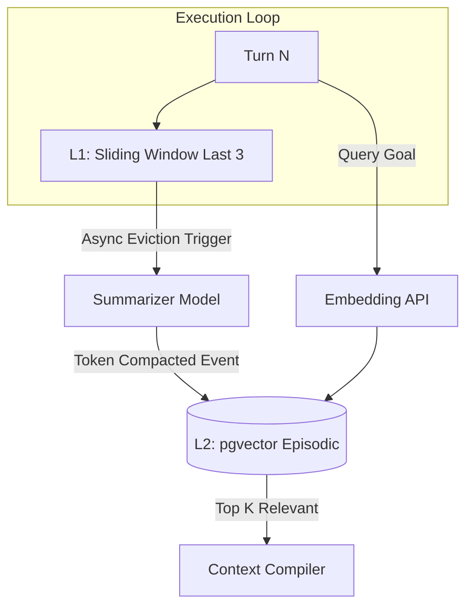
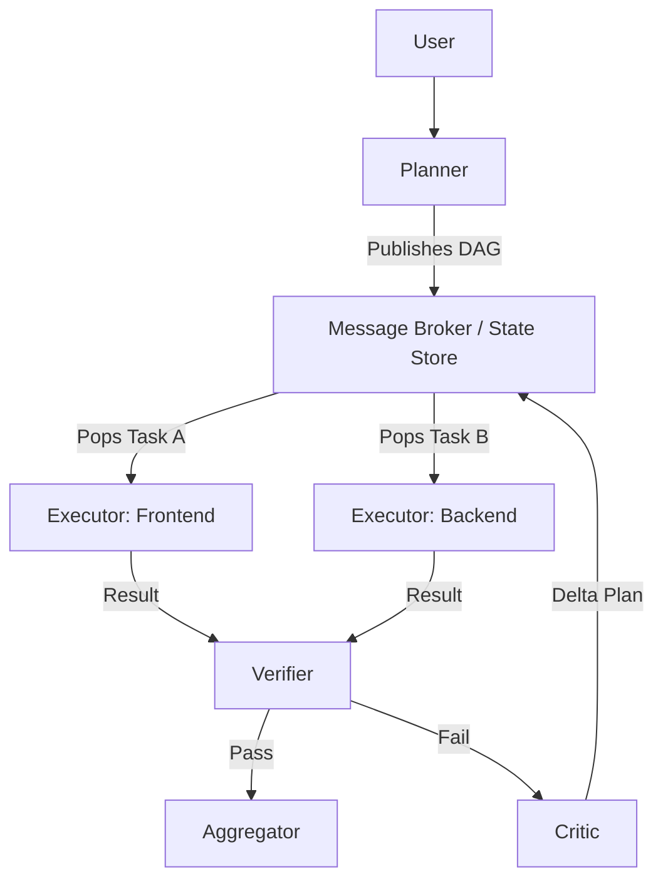

# Frontier Architecture Improvements: Implementation Blueprint

# Memory System Redesign Blueprint

The current `.jsonl` transcript accumulation is an $O(N)$ token burn. We propose a **Tiered Graph-RAG Episodic Pipeline** that decouples execution state from historical narrative.

### Architecture & Storage Layers
- **L1 (Working Memory / Hot State):** In-memory (Redis or Actor State). Stores exactly the current goal, the active plan, and a sliding window of the last 3 state transitions.
- **L2 (Semantic & Episodic Store):** PostgreSQL + `pgvector`. Stores immutable state-transition events. Each event is embedded using a fast embedding model (`text-embedding-004`).
- **L3 (Knowledge Graph / Compressed State):** Network of entities (e.g., File A, Bug B) maintained asynchronously to represent the system's "understanding" without raw text.

### Implementation Blueprint
1. **Event-Driven Pruning:** When $Turn > 5$, an asynchronous background task fires. It pulls turns $T-5$ to $T-2$, compresses them into a single dense summary vector, writes to L2, and evicts them from L1.
2. **Context-Driven Retrieval:** At each new user turn, the Prompt Compiler embeds the current active goal. It queries L2 for $K=3$ most relevant past episodes.
3. **TTL / Expiration:** Transient execution failures (e.g., "npm install failed, retrying with sudo") are given a TTL of 1 hour in L2. Only successful milestone states are persisted indefinitely.
4. **Retrieval Ranking:** Uses Reciprocal Rank Fusion (RRF) combining semantic similarity (cosine distance) with temporal decay ($Score = Similarity * e^{-\lambda * \Delta t}$).

**Token Savings Estimate:** 85-95% reduction in context payload on conversations > 50 turns.

---

# Progressive Skill Loading Architecture

Statically injecting all `SKILL.md` documents and MCP definitions into the system prompt wastes inactive context.

### The Context-on-Demand Router
1. **Capability Indexing:** Pre-compute embeddings for every tool, skill, and plugin description. Store these in a fast local vector index (e.g., FAISS).
2. **Semantic Skill Retrieval:** When a goal is formed, embed the goal. Retrieve the Top-3 required skills.
3. **Lazy Instruction Injection:** Inject the tool JSON schema and skill instructions *only* into the specific Executor agent tasked with that goal.

### Implementation Blueprint
- **Router Agent:** A highly-quantized, ultra-fast local model (or API like Gemini Flash) acts as a strict JSON router. 
  - *Input:* User Goal. 
  - *Output:* `["github_mcp", "frontend-design"]`.
- **System Prompt Compiler:** Dynamically constructs the system prompt per-turn. If the Router drops `frontend-design` from the active array, it is instantly purged from the context window.

**Expected Token Savings:** ~2,000 to 5,000 tokens per execution loop.

---

# Critic/Verifier Agent Design

Current state relies on the primary execution agent to self-correct within the same CoT, which contaminates the context window with failure logs and inflates token usage.

### Optimal Topology & Adaptive Depth
1. **Syntax / Static Verifier (0 Tokens):** Output code is piped through `eslint` / `ruff` / `tsc`. If it fails, the error is routed back to the Executor immediately.
2. **Fast-Critic (Low Tokens):** If static checks pass, the output and original goal are sent to a fast, cheap model (Gemini Flash). It uses a strict boolean evaluation prompt: `{"goal_met": true, "hallucinations": false, "confidence": 0.95}`.
3. **Deep Reflection (High Tokens):** Only triggered if Fast-Critic confidence is $< 0.8$ or `goal_met` is false. This invokes a frontier model to analyze the failure and generate a localized patch.

### Token-Efficient Reflection Logic
The Critic **does not** return a full rewritten file. It returns a `diff` or a `.patch` file format, forcing the Executor to apply delta changes using `replace_file_content`.

---

# Optimal Agent Orchestration Topology

### Event-Driven Message Passing
Antigravity must transition from monolithic CoT to a **Distributed Actor Model**.
- **The Message Bus:** Agents communicate strictly via a Kafka/Redis pub-sub bus. No agent "owns" the full context.
- **Planner (The Brain):** Outputs an execution DAG (Directed Acyclic Graph). Sends `TaskMessage` to the queue.
- **Executor (The Hands):** Stateless worker. Pops `TaskMessage`, loads the minimum required skills via Progressive Loading, executes, and publishes `ResultMessage`.

**Deadlock Prevention:** Every task in the DAG is given a strict token budget and a wall-clock timeout. If an Executor hits the limit, a `TaskTimeout` event triggers the Critic to rethink the approach.

---

# Token Reduction Framework

| Strategy | Token Reduction % | Implementation Complexity | Priority | Tradeoff |
|----------|-------------------|---------------------------|----------|----------|
| **Sparse Context Injection** | 40-50% | High | P0 | Requires perfect capability routing; high risk of missing context if router fails. |
| **Response Semantic Caching** | 10-15% | Medium | P1 | Can serve stale API data if cache invalidation logic is weak. |
| **Delta-Context Updates** | 20-30% | Very High | P1 | Complex to maintain state synchronization between LLM and local filesystem. |
| **Intermediate-Output Suppression** | 15% | Low | P0 | Reduces transparency into the agent's step-by-step reasoning for the end user. |
| **Adaptive Reasoning Depth** | 25-40% | Medium | P2 | Relies on a secondary cheap model to accurately classify task difficulty. |

---

# Autonomous Scaling Recommendations & AGI-Scale Bottleneck Forecast

### AGI-Scale Bottlenecks Forecast
1. **Coordination Entropy:** As the number of subagents scales past 10, the token overhead of agent-to-agent communication (messaging protocols, greetings, state sharing) will exceed the execution tokens.
2. **Context Fragmentation:** Over-aggressive pruning of episodic memory will lead to "amnesia loops" where the agent solves a bug, forgets the context 100 turns later, and re-introduces the bug.
3. **MCP Serialization Bloat:** Passing massive base64 images, deep directory trees, or unpaginated API responses from MCP servers will hit context limits instantly.

### AGI-Era Redesign Recommendations
- **Binary/Latent Space Communication:** Future agents should not communicate in English. They should pass compressed embedding vectors representing state/intent to bypass the language token bottleneck entirely.
- **Filesystem Virtualization:** Do not read full files into the prompt. Mount a virtual file system where the LLM can query specific AST nodes (e.g., `get_function_body("auth.js", "login")`).

---

# Highest ROI Refactors & Implementation Priority Matrix

### **P0: Immediate Execution (Days)**
1. **Sliding Window Pruning:** Implement hard eviction for `transcript.jsonl` beyond the last 10 turns.
2. **Static Capability Purge:** Remove all `SKILL.md` content from the root system prompt; implement a hardcoded mapping router for the top 5 skills.
3. **AST-First Verification:** Route all code generation through local syntax checkers before LLM reflection.

### **P1: Short-Term Engineering (Weeks)**
1. **Vector-Backed Episodic Memory:** Deploy `pgvector` or local SQLite-vss to store embedded milestone states.
2. **Adaptive Depth Critic:** Implement the Gemini-Flash-based boolean Verifier loop.

### **P2: Long-Term Architecture (Months)**
1. **Actor Model Orchestration:** Decouple agents into discrete background processes communicating via a formal message broker.
2. **Graph-RAG Implementation:** Build the semantic entity-relationship memory store.

---

# Final Frontier Architecture Verdict
By stripping away the monolithic system prompt and replacing linear transcript growth with a hierarchical, vector-backed Actor model, Antigravity shifts from a highly capable *chatbot* to a true *headless distributed operating system*. This architecture directly addresses the scaling collapse risks of AGI, optimizing absolutely for execution speed, token scarcity, and autonomous resilience.
