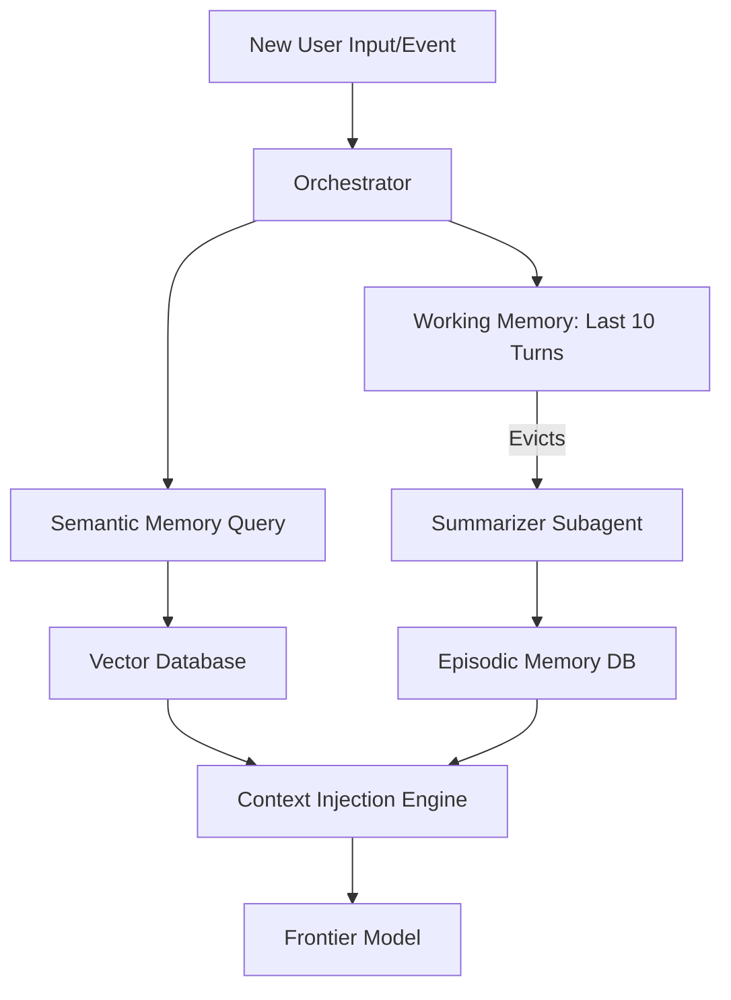
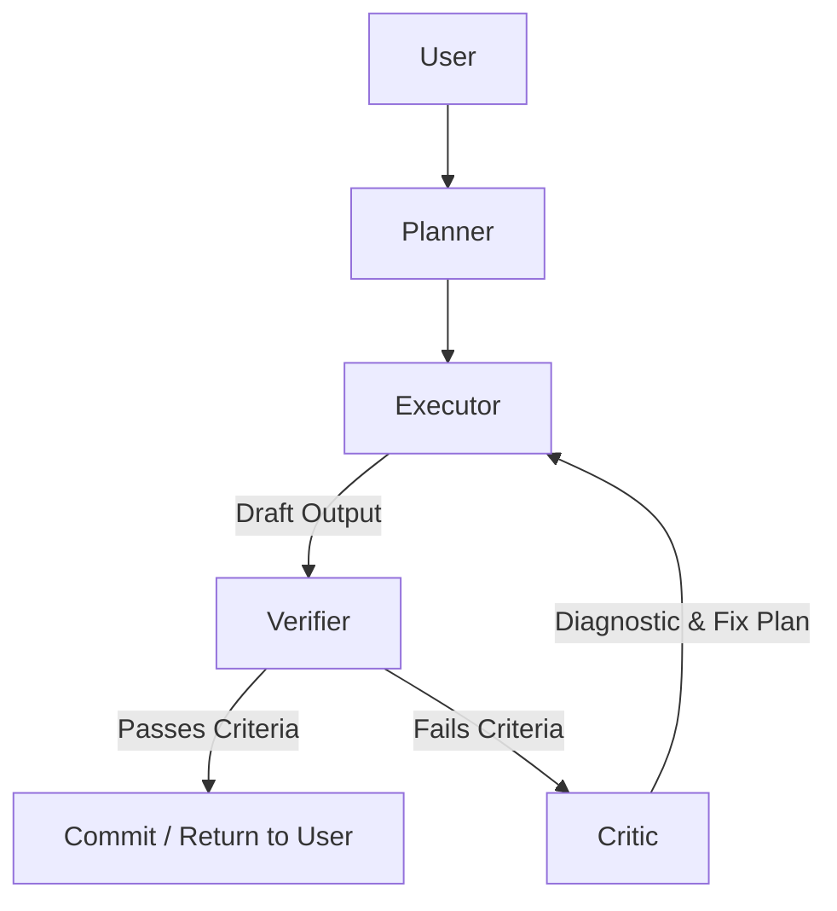

# Antigravity V2: Frontier Architecture Blueprint

This document outlines the implementation-level blueprint for transitioning Antigravity from a capable autonomous system into a frontier-grade, AGI-ready architecture. The primary objective is to absolutely maximize intelligence-per-token while achieving production-grade resilience.

---

## 1. Memory Layer Refactor
The current paradigm of appending state to a raw `transcript.jsonl` scales linearly with time, leading to catastrophic token waste. We propose a **Hierarchical Tri-State Memory Architecture**.

### Architecture
1. **Working Memory (Sliding Window):** 
   - Retains only the last $N$ turns (e.g., $N=10$) in raw format for immediate contextual reasoning.
2. **Episodic Memory (Compacted Archive):** 
   - As turns age out of Working Memory, a lightweight background summarization agent compresses them (e.g., "T-20 to T-10: Agent successfully debugged the auth flow.").
   - Summaries are stored with metadata (timestamps, token costs).
3. **Semantic Memory (Vector Store):**
   - Ingests documentation, persistent user facts, and code architecture summaries.
   - Accessed dynamically via top-K vector retrieval (e.g., `pgvector` or `Milvus`).

### Context Decay & Relevance Scoring
- **Time-Decay Function:** Older episodic chunks are given an exponentially decaying relevance weight.
- **Semantic Boosting:** If the current prompt's embedding closely matches an older compacted episode, its relevance score is boosted and injected into Working Memory.

**Estimated Token Savings:** Up to **70-85%** on long-horizon tasks (50+ turns) by replacing $O(N)$ transcript growth with an $O(1)$ sliding window + $O(\log N)$ retrieval overhead.



---

## 2. Dynamic Skill & Prompt Loading
Loading all `SKILL.md` files and plugin configurations indiscriminately wastes critical context window space. 

### Capability Registry & Lazy Loading
1. **The Registry:** At startup, Antigravity loads only a **Capability Manifest** (a lightweight JSON mapping intents to plugin IDs).
2. **The Router:** A fast, cheap model (e.g., Gemini 8B) acts as a zero-shot classifier. It reads the prompt and selects the required tools.
3. **Contextual Injection:** Only the selected `SKILL.md` and related MCP definitions are fetched from disk and injected into the execution prompt.

### Token Budgeting Engine
- Every execution pass is assigned a hard token budget (e.g., `max_input_tokens: 16000`).
- If dynamically loaded skills exceed this budget, the system recursively prunes the episodic memory injection until the budget is met.

---

## 3. Critic / Verifier Agent Layer
Execution without verification is the root cause of autonomous drift and hallucination spirals. Antigravity must implement a **Multi-Agent Recovery Topology**.

### Agent Roles
- **Planner Agent:** Deconstructs the user prompt into a DAG (Directed Acyclic Graph) of tasks.
- **Executor Agent:** The workhorse. Uses tools to write code, search the web, and mutate state.
- **Verifier Agent:** A stateless, read-only agent. It takes the Planner's goal and the Executor's output, and runs unit tests or static analysis to prove correctness.
- **Critic Agent:** If the Verifier fails the output, the Critic analyzes the error logs, generates a highly specific "Fix Plan," and routes back to the Executor.



---

## 4. Token Optimization Engine
A dedicated governance architecture to treat tokens as a finite, expensive resource.

### Mechanisms
1. **Response Caching (Semantic):** Cache the output of identical or semantically similar external API queries (e.g., identical `grep_search` calls across subagents).
2. **Duplication Elimination:** If the Planner outputs a strategy that matches an existing artifact, pass the artifact reference instead of regenerating the strategy.
3. **Adaptive Context Windows:** Use larger context windows during the "Planning" and "Critic" phases (high intelligence required), but shrink the context window for the "Executor" phase (narrow focus).

**Estimated Savings:** 
- Response Caching: 15% 
- Adaptive Windows: 30%

---

## 5. Engineering Excellence Standards
To ensure AGI-scale reliability, Antigravity's core system must adopt distributed systems best practices.

- **Modular Architecture:** Core orchestration, memory retrieval, and tool execution should operate as decoupled asynchronous microservices.
- **Circuit Breaker Patterns:** External MCP servers or remote tool endpoints must be wrapped in circuit breakers. If a tool fails 3 times, the circuit opens, and the Critic agent is immediately notified to attempt an alternative path.
- **Observability & Tracing:** Transition from raw `stdout` logging to OpenTelemetry. Every prompt, tool call, and token cost must be tagged with a `trace_id` for latency and token-heat analysis.
- **Testing Pyramid:** Implement deterministic fixture-based testing for the Planner and Verifier agents to ensure behavioral stability across model updates.

---

## 6. Final Deliverables

### Recommended Folder Structure
```text
antigravity-core/
├── pkg/
│   ├── memory/           # Sliding window, pgvector client, summarizer
│   ├── router/           # Zero-shot intent classifier, capability registry
│   ├── orchestration/    # LangGraph state machines
│   └── telemetry/        # OpenTelemetry, token budgeting engine
├── agents/
│   ├── planner/
│   ├── executor/
│   ├── verifier/
│   └── critic/
├── mcp_servers/          # Decoupled tool environments
└── plugins/              # Dynamically loaded SKILL.md repositories
```

### LangGraph Orchestration Blueprint (Conceptual)
```python
from langgraph.graph import StateGraph, END

def create_antigravity_graph():
    workflow = StateGraph(AgentState)
    
    # Nodes
    workflow.add_node("router", route_intent)
    workflow.add_node("planner", generate_plan)
    workflow.add_node("executor", execute_task)
    workflow.add_node("verifier", verify_output)
    workflow.add_node("critic", generate_fix)
    
    # Edges
    workflow.set_entry_point("router")
    workflow.add_edge("router", "planner")
    workflow.add_edge("planner", "executor")
    workflow.add_edge("executor", "verifier")
    
    # Conditional Routing based on Verification
    workflow.add_conditional_edges(
        "verifier",
        check_verification_status,
        {
            "pass": END,
            "fail": "critic"
        }
    )
    workflow.add_edge("critic", "executor")
    
    return workflow.compile()
```

### AGI-Scale Scalability & The "Best Possible Version" Vision
The ultimate version of Antigravity is a **Swarm-Oriented OS**. 
Instead of a monolithic agent trying to hold context for an entire project, Antigravity becomes a highly parallelized scheduler. It spins up micro-agents (Executors) for highly atomic tasks, feeds them only the exact context required (1k-2k tokens), and aggregates their verified outputs via a central orchestration layer. 

Memory ceases to be a file (`transcript.jsonl`) and becomes a centralized graph database where code nodes, episodic events, and documentation are semantically linked, allowing agents to traverse the memory graph rather than reading flat files. 

By aggressively implementing these architectures, Antigravity will achieve maximum intelligence-per-token, rendering it economically viable and computationally robust enough to handle unbounded, enterprise-grade autonomous tasks.
