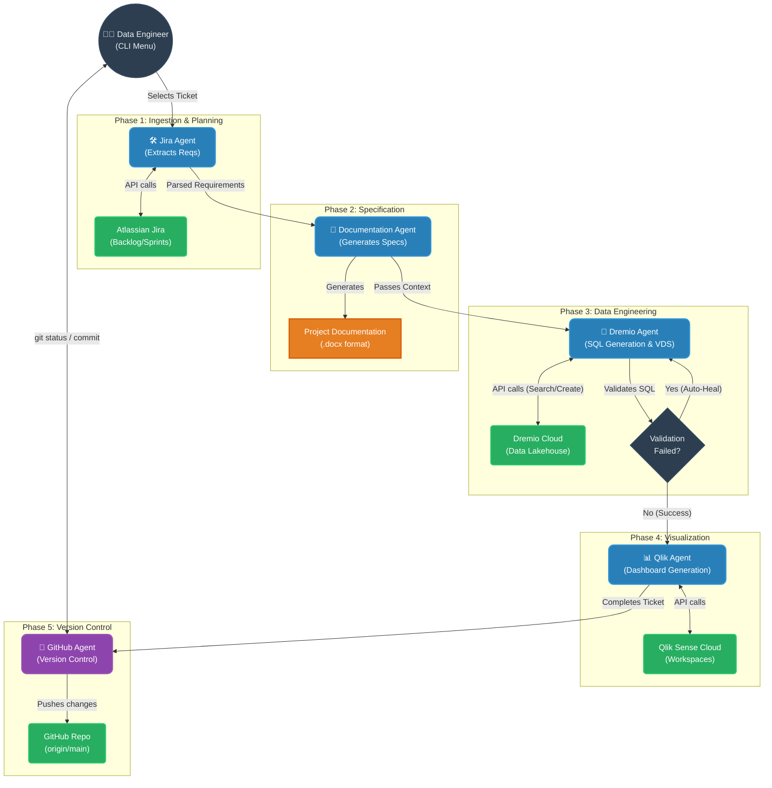

# ADL Automated Delivery Pipeline Architecture

This diagram illustrates how the Multi-Agent system collaborates to automate the end-to-end delivery of data products for ASL Airlines.

### Key Workflow Characteristics:
1. **Human-in-the-Loop (HITL)**: You control the progression at major "gates" between agents.
2. **State Passing**: The `TicketRequirements` object acts as the central brain, carrying context (ticket ID, business logic, feedback) seamlessly from agent to agent.
3. **Auto-Healing**: The Dremio Agent captures live API errors and loops back onto itself to rewrite SQL dynamically.
4. **Autonomous Source Control**: The workflow seals itself by ensuring all agent-generated artifacts and code are versioned locally and remotely.
